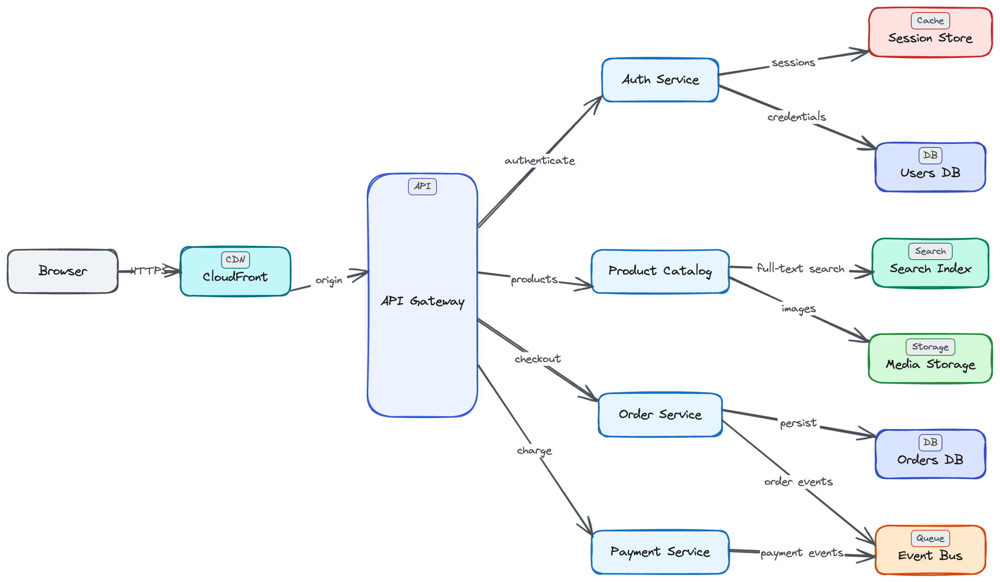
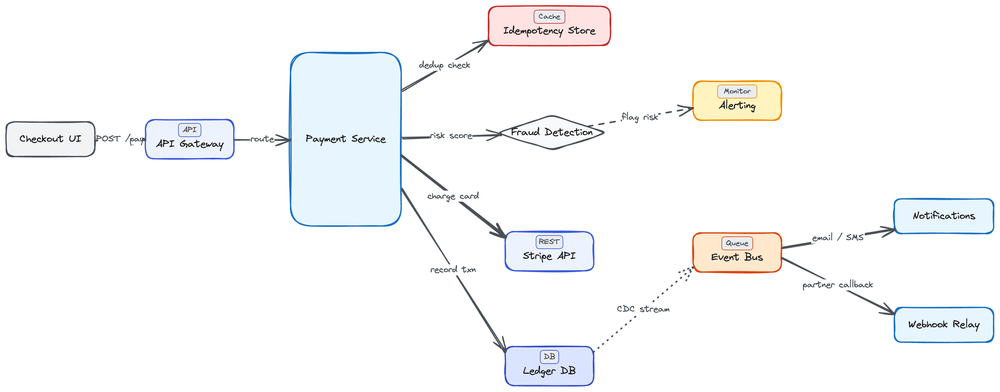

# Excalidraw Architect MCP

An MCP server that generates beautiful Excalidraw architecture diagrams with perfect auto-layout, stateful editing, and architecture-aware component styling.

**No API keys. No local models. Works with any AI IDE that supports MCP** (Cursor, Windsurf, etc.).

## Examples

> All diagrams below were generated entirely by AI using this MCP -- zero manual positioning.

### E-Commerce Platform Architecture



### Payment Processing Flow



## The Problem

AI IDEs generate diagrams as Mermaid or ASCII art. When they try Excalidraw, they hallucinate coordinates - boxes overlap, arrows cross, and the result needs manual cleanup.

## The Solution

Tell the AI *what* to draw. This MCP handles *where* and *how*.

- **Perfect layouts every time** - Sugiyama algorithm with adaptive spacing; no overlapping boxes
- **Architecture-aware styling** - Say "Kafka" and get a stream-styled node, not a generic rectangle
- **Talk to your diagrams** - Add, remove, or rewire components on an existing diagram with natural language
- **Hub node visualization** - Gateways and load balancers auto-stretch to span their connected services

## Quick Start

### Install

```bash
# From source (recommended for now)
git clone https://github.com/BV-Venky/excalidraw-architect-mcp.git
cd excalidraw-architect-mcp
uv pip install .

# Or with pip
pip install git+https://github.com/BV-Venky/excalidraw-architect-mcp.git
```

### Configure MCP in Your IDE

**Cursor** - Add to `.cursor/mcp.json`:

```json
{
  "mcpServers": {
    "excalidraw-architect": {
      "command": "excalidraw-architect-mcp",
      "transport": "stdio"
    }
  }
}
```

**Windsurf / Other IDEs** - Same pattern; point to the `excalidraw-architect-mcp` command over stdio.

### Use It

Just ask your AI IDE naturally:

> "Create an architecture diagram for a microservices system with an API Gateway, Auth Service, User Service, Order Service, PostgreSQL, Redis cache, and Kafka event bus"

The AI calls the MCP tool with the relationship map. The MCP handles layout, styling, and output. Open the resulting `.excalidraw` file with the [Excalidraw VS Code extension](https://marketplace.visualstudio.com/items?itemName=pomdtr.excalidraw-editor) or drag it into [excalidraw.com](https://excalidraw.com).

## Features

### Auto Layout Engine

Uses the Sugiyama hierarchical layout algorithm with:

- **Adaptive layer gaps** - spacing adjusts based on edge label length
- **Hub node stretching** - gateways/load balancers stretch to span connected services
- **Obstacle-aware edge routing** - arrows curve around intermediate nodes instead of cutting through them
- **Disconnected component stacking** - separate subgraphs (e.g., monitoring stack) are placed without overlap

### Component Library

50+ technology mappings with automatic visual styling:

| Category | Technologies |
|---|---|
| Database | PostgreSQL, MySQL, MongoDB, DynamoDB, Cassandra, ClickHouse, SQLite, CockroachDB |
| Message Queue | Kafka, RabbitMQ, SQS, Redis Streams, NATS |
| Cache | Redis, Memcached, Varnish |
| Load Balancer | Nginx, HAProxy, ALB/ELB, Traefik, Envoy |
| Compute | Docker, Kubernetes, Lambda, ECS, Fargate |
| Storage | S3, GCS, Azure Blob, MinIO |
| API | REST, GraphQL, gRPC, WebSocket |
| CDN | CloudFront, Cloudflare |
| Monitoring | Prometheus, Grafana, Datadog, ELK |
| Client | Browser, Mobile, Desktop, CLI |

### Stateful Editing

Diagram metadata is embedded in the `.excalidraw` file. Ask the AI:

> "Add a Redis cache in front of the database in the existing diagram"

The MCP reads the current state, applies the modification, and re-renders with proper layout.

### Mermaid Conversion

Already have a Mermaid flowchart? Convert it:

> "Convert this Mermaid diagram to Excalidraw" (paste your Mermaid syntax)

## MCP Tools

| Tool | Description |
|---|---|
| `create_diagram` | Create a new diagram from structured node/connection data |
| `mermaid_to_excalidraw` | Convert Mermaid flowchart syntax to `.excalidraw` |
| `modify_diagram` | Add/remove/update nodes and connections on an existing diagram |
| `get_diagram_info` | Read current diagram state (call before modifying) |

### `create_diagram` Parameters

| Parameter | Type | Description |
|---|---|---|
| `nodes` | `list[dict]` | Nodes with `id`, `label`, optional `component_type` and `shape` |
| `connections` | `list[dict]` | Edges with `from_id`, `to_id`, optional `label` and `style` |
| `output_path` | `str` | Where to save the `.excalidraw` file |
| `direction` | `str` | `"LR"` (default), `"TD"`, `"BT"`, `"RL"` |
| `theme` | `str` | `"default"`, `"dark"`, `"colorful"` |

### Node Shapes

`rectangle` (default), `diamond`, `ellipse`, `circle`, `stadium`, `parallelogram`

### Edge Styles

`solid` (default), `dashed`, `dotted`, `thick`

## Architecture

```
AI IDE ──MCP──▶ server.py ──▶ engine/layout.py ──▶ engine/renderer.py ──▶ .excalidraw
                   │              │                       │
                   ├─ parsers/    ├─ grandalf              ├─ core/components.py
                   │  mermaid.py  │  (Sugiyama)            ├─ core/themes.py
                   └─ parsers/    └─ Adaptive gaps,        └─ JSON + metadata
                      state.py      hub stretch,
                                    obstacle routing
```

The AI IDE's LLM provides the *what* (nodes and connections). The MCP server handles the *how* (layout, styling, rendering). No AI inference happens in the MCP - all reasoning is done by the IDE's built-in model.

## Development

```bash
# Clone the repo
git clone https://github.com/BV-Venky/excalidraw-architect-mcp.git
cd excalidraw-architect-mcp

# Run tests (hatch auto-creates the env on first run)
hatch run test

# Lint + format check (same as CI)
hatch run check

# Auto-fix lint issues + format
hatch run fix

# Start the MCP server locally
hatch run serve
```

See [CONTRIBUTING.md](CONTRIBUTING.md) for the full list of commands and guidelines.

## Project Structure

```
src/excalidraw_mcp/
├── server.py              # FastMCP server - exposes 4 MCP tools
├── core/                  # Foundation: data models + styling
│   ├── models.py          # Pydantic models (DiagramGraph, LayoutResult, etc.)
│   ├── components.py      # Technology → visual style mapping (50+ components)
│   └── themes.py          # Color themes (default, dark, colorful)
├── engine/                # Computational core
│   ├── layout.py          # Sugiyama layout with adaptive gaps & obstacle routing
│   └── renderer.py        # Excalidraw JSON builder (shapes, arrows, bindings)
└── parsers/               # Input adapters
    ├── mermaid.py          # Mermaid flowchart → DiagramGraph parser
    └── state.py            # Stateful editing (read/modify existing diagrams)
```

## Contributing

Contributions are welcome! See [CONTRIBUTING.md](CONTRIBUTING.md) for guidelines.

## License

MIT - see [LICENSE](LICENSE).
