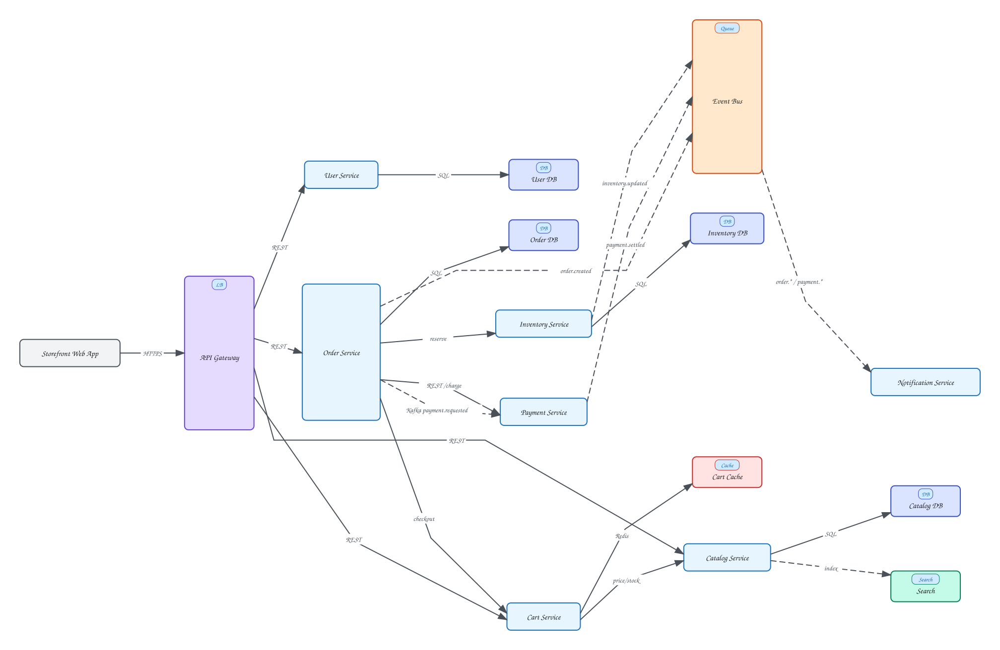

# Excalidraw Architect MCP
<!-- mcp-name: io.github.BV-Venky/excalidraw-architect-mcp -->
[](https://pypi.org/project/excalidraw-architect-mcp/)
[](https://cursor.directory/mcp/excalidraw-architect-mcp)
[](LICENSE)
[](https://pepy.tech/projects/excalidraw-architect-mcp)


It's been a constant struggle trying to understand unfamiliar and complex codebases - managing cognitive overload and trying to imagine how everything fits together.

## The Problem

When you're onboarding onto a codebase, designing a new system, or documenting existing architecture, a visual diagram communicates in seconds what pages of text can't. But the options today aren't great. Mermaid diagrams are quick to generate but have limited capabilities - you can't drag a node to reposition it, group components visually. Excalidraw solves these problems, but when LLMs try to generate Excalidraw directly, they hallucinate coordinates - boxes overlap, arrows tangle, and you end up fixing the diagram manually.

## The Solution

**excalidraw-architect-mcp** separates the *what* from the *where* - the AI focuses on structure, the engine handles the pixel math.

Your LLM describes the components and connections, and the MCP handles layout, styling, and rendering using a proper graph layout algorithm. 50+ technologies (Kafka, PostgreSQL, Redis, etc.) get auto-styled, you can iteratively edit diagrams with natural language ("add a cache in front of the DB"), and it runs fully offline in Cursor/Windsurf - no API keys needed.

- **Living architecture knowledge graph** - persist your system as a version-controlled model your AI can query, lint, and re-render — diagrams become *views*, not the source of truth ([details](#-architecture-knowledge-graph))
- **Perfect layouts every time** - Sugiyama algorithm with adaptive spacing; no overlapping boxes
- **Architecture-aware styling** - say "Kafka" and get a stream-styled node, not a generic rectangle
- **Talk to your diagrams** - add, remove, or rewire components on an existing diagram with natural language
- **Hub node visualization** - gateways and load balancers auto-stretch to span their connected services
- **Export to SVG & PNG** - convert any `.excalidraw` file to a portable image, no browser needed

## See It In Action

> Every frame below is generated entirely by AI using this MCP - zero manual positioning.

### E-Commerce Platform Architecture


### Payment Processing Flow


## 🧠 Architecture Knowledge Graph

> **New in v1.0.** Your diagrams were always backed by a graph. Now that graph is *yours* — a persistent, version-controlled model of your system that the AI builds once and reuses everywhere.



> *The diagram above was rendered from a knowledge graph — a single `.claude/architecture.md` file. Notice `Order Service → Payment Service` appears twice: a solid `REST /charge` call and a dashed `Kafka payment.requested` event. Two communication modes, two arrows.*

### Why a knowledge graph?

A one-off diagram goes stale the moment you close it. A **knowledge graph** is a living model:

- **One source of truth, many views** — store the whole system once, then render the full picture, a single domain, or everything within N hops of one service.
- **Consistent across diagrams** — the same service keeps the same id, styling, and metadata everywhere.
- **Queryable** — ask "what breaks if payments goes down?" and get the real blast radius, not a guess.
- **Self-checking** — lint for dependency cycles, single points of failure, and orphaned services.
- **Lives in git** — review architecture changes in PRs; the markdown diffs cleanly.

### The file is human- *and* machine-readable

The graph is a single markdown file (default `.claude/architecture.md`):

```markdown
## Services
- order-service: Order Service [type: service] [domain: orders] [owner: @orders]
- payment-service: Payment Service [type: service] [domain: payments] [owner: @payments]

## Dependencies
- order-service -> payment-service : "REST /charge"
- order-service -> payment-service : "Kafka payment.requested" [style: dashed]
```

Edit it by hand or let the AI maintain it — it round-trips losslessly either way.

### Just ask your AI

> "Map this codebase into the architecture knowledge graph"

> "Link the order service to payments over Kafka"

> "What depends on the payment service? Render just its neighborhood"

> "Render the orders domain as a focused diagram"

> "Lint the architecture for cycles and single points of failure"

> "Import my existing diagram.excalidraw into the knowledge graph"

> "Generate an onboarding guide from the architecture"

See the [Knowledge Graph tools](#mcp-tools) for the full tool list.

## Use Cases

- **Onboarding onto a new codebase** - point it at a microservice and get a high-level architecture diagram without reading a single line of code. Point it to a set of classes for a low-level flow diagram when you need the details.
- **Brainstorming and system design** - when you're whiteboarding a new service or debating trade-offs, ask it to visualize the architecture as you go. Iterate by saying "add a cache here" or "swap Kafka for SQS" instead of redrawing from scratch.
- **Documentation that stays alive** - drop the `.excalidraw` file into your repo and update it with natural language as the system evolves. No more stale diagrams from six sprints ago.

## Quick Start

### Install

```bash
pip install excalidraw-architect-mcp
```

For **PNG export** support (SVG works out of the box):

```bash
pip install excalidraw-architect-mcp[png]
```

Or run without installing (requires [uv](https://docs.astral.sh/uv/)):

```bash
uvx excalidraw-architect-mcp
```

### Configure MCP in Your IDE

**Cursor** - Add to `.cursor/mcp.json`:

```json
{
  "mcpServers": {
    "excalidraw-architect": {
      "command": "excalidraw-architect-mcp",
      "transport": "stdio"
    }
  }
}
```

**Claude Code** - Run this one-liner:

```bash
claude mcp add-json excalidraw-architect '{"type":"stdio","command":"excalidraw-architect-mcp"}' --scope user
```

Or add manually to `.mcp.json` in your project root:

```json
{
  "mcpServers": {
    "excalidraw-architect": {
      "type": "stdio",
      "command": "excalidraw-architect-mcp"
    }
  }
}
```

**Windsurf / Other IDEs** - Same pattern; point to the `excalidraw-architect-mcp` command over stdio.

### Install the Diagram Design Skill (recommended)

This repo includes a [Diagram Design Skill](.skills/excalidraw-diagram-design/SKILL.md) that teaches the AI how to structure diagrams for the best results - node count limits, topology rules, edge label guidelines, and common patterns.

**For Cursor users:**

```bash
mkdir -p ~/.cursor/skills/excalidraw-diagram-design && \
curl -o ~/.cursor/skills/excalidraw-diagram-design/SKILL.md \
  https://raw.githubusercontent.com/BV-Venky/excalidraw-architect-mcp/main/.skills/excalidraw-diagram-design/SKILL.md
```

**For other IDEs:** Download the [SKILL.md](.skills/excalidraw-diagram-design/SKILL.md) file and add it to your IDE's prompt context or system instructions.

The AI will automatically pick up the skill and apply it when generating diagrams. Feel free to modify the rules to suit your preferences - tweak node limits, add your own patterns, or adjust styling guidelines.

### Install the Knowledge Graph Skill (recommended for the graph workflow)

For the [architecture knowledge graph](#-architecture-knowledge-graph), this repo also includes an [Architecture Knowledge Graph Skill](.skills/architecture-knowledge-graph/SKILL.md). It teaches the AI how to read a codebase well — identify service boundaries, map communication signals (HTTP / gRPC / Kafka / DB) to the right labelled links, match producers and consumers across repos, and keep the graph clean (stable ids, every edge labelled, lint before render).

**For Cursor users:**

```bash
mkdir -p ~/.cursor/skills/architecture-knowledge-graph && \
curl -o ~/.cursor/skills/architecture-knowledge-graph/SKILL.md \
  https://raw.githubusercontent.com/BV-Venky/excalidraw-architect-mcp/main/.skills/architecture-knowledge-graph/SKILL.md
```

**For other IDEs:** Download the [SKILL.md](.skills/architecture-knowledge-graph/SKILL.md) file and add it to your IDE's prompt context or system instructions.

> **A note on diagram complexity:** As the number of components and connections grows, diagrams inevitably become harder to read - this is true for humans drawing by hand too, not just automated layout. For best results, aim for **6-15 nodes** in architecture diagrams and **10-25 nodes** in detailed flows. If your system is larger, split it into multiple focused diagrams rather than cramming everything into one.

### Use It

Just ask your AI IDE naturally:

> "Create a high-level architecture diagram of this codebase"

> "Create an architecture diagram for a microservices system with an API Gateway, Auth Service, User Service, Order Service, PostgreSQL, Redis cache, and Kafka event bus"

> "Convert this mermaid diagram to excalidraw diagram"

> "Add a Caching layer to the Order Service in the High Level architecture diagram"

> "Export the architecture diagram to SVG"

> "Export the diagram as a PNG at 3x resolution"

The AI calls the MCP tool with the relationship map. The MCP handles layout, styling, and output. Open the resulting `.excalidraw` file with the [Excalidraw VS Code extension](https://marketplace.visualstudio.com/items?itemName=pomdtr.excalidraw-editor) or drag it into [excalidraw.com](https://excalidraw.com).

## Features

### Auto Layout Engine

Uses the Sugiyama hierarchical layout algorithm with:

- **Adaptive layer gaps** - spacing adjusts based on edge label length
- **Hub node stretching** - gateways/load balancers stretch to span connected services
- **Obstacle-aware edge routing** - arrows curve around intermediate nodes instead of cutting through them
- **Disconnected component stacking** - separate subgraphs (e.g., monitoring stack) are placed without overlap

### Component Library

50+ technology mappings with automatic visual styling:

| Category | Technologies |
|---|---|
| Database | PostgreSQL, MySQL, MongoDB, DynamoDB, Cassandra, ClickHouse, SQLite, CockroachDB |
| Message Queue | Kafka, RabbitMQ, SQS, Redis Streams, NATS |
| Cache | Redis, Memcached, Varnish |
| Load Balancer | Nginx, HAProxy, ALB/ELB, Traefik, Envoy |
| Compute | Docker, Kubernetes, Lambda, ECS, Fargate |
| Storage | S3, GCS, Azure Blob, MinIO |
| API | REST, GraphQL, gRPC, WebSocket |
| CDN | CloudFront, Cloudflare |
| Monitoring | Prometheus, Grafana, Datadog, ELK |
| Client | Browser, Mobile, Desktop, CLI |

### Stateful Editing

Diagram metadata is embedded in the `.excalidraw` file. Ask the AI:

> "Add a Redis cache in front of the database in the existing diagram"

The MCP reads the current state, applies the modification, and re-renders with proper layout.

### Mermaid Conversion

Already have a Mermaid flowchart? Convert it:

> "Convert this Mermaid diagram to Excalidraw" (paste your Mermaid syntax)

### Image Export

Export any `.excalidraw` diagram to a portable image — no browser, Excalidraw app, or Node.js required.

- **SVG** - zero extra dependencies; uses a pure-Python renderer that handles rectangles, ellipses, diamonds, text (including multiline), and arrows with arrowheads
- **PNG** - requires the optional `cairosvg` package (`pip install excalidraw-architect-mcp[png]`); supports a configurable resolution multiplier (default 2×)

> "Export the architecture diagram as an SVG"

## MCP Tools

### Diagram tools

| Tool | Description |
|---|---|
| `create_diagram` | Create a new diagram from structured node/connection data |
| `mermaid_to_excalidraw` | Convert Mermaid flowchart syntax to `.excalidraw` |
| `modify_diagram` | Add/remove/update nodes and connections on an existing diagram |
| `get_diagram_info` | Read current diagram state (call before modifying) |
| `export_diagram` | Export `.excalidraw` to SVG or PNG image |

### Knowledge graph tools (`kg_*`)

The architecture knowledge graph (default `.claude/architecture.md`) is the source of truth; diagrams are rendered views of it.

| Tool | Description |
|---|---|
| `kg_init` | Create a new knowledge graph file |
| `kg_add_service` / `kg_remove_service` | Add/update or remove a service (with type, domain, owner, tags, links) |
| `kg_link` / `kg_unlink` | Add/remove a dependency (parallel edges supported — e.g. REST *and* Kafka between the same pair) |
| `kg_set_domain` | Group a service into a domain / bounded context |
| `kg_info` | Summarize services, domains, and topology |
| `kg_render` | Render the whole architecture to `.excalidraw` |
| `kg_render_view` | Render a focused diagram of specific services |
| `kg_render_around` | Render everything within N hops of a service |
| `kg_render_domain` | Render a single domain |
| `kg_import` | Bootstrap the graph from an existing `.excalidraw` diagram |
| `whats_connected_to` | Impact analysis — upstream/downstream blast radius |
| `kg_path` | Trace the dependency path between two services |
| `kg_lint` | Health check: cycles, single points of failure, orphans, dangling refs |
| `kg_export` | Export the graph to Mermaid, Graphviz DOT, or JSON |
| `kg_diff` | Show how the architecture changed since a git ref |
| `kg_onboarding_doc` | Generate a human onboarding guide from the graph |
| `kg_drift` | Detect drift between the declared graph and Python imports |

## Contributing

See [CONTRIBUTING.md](CONTRIBUTING.md) for details.

## License

MIT - see [LICENSE](LICENSE).
